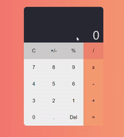
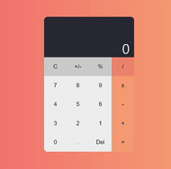
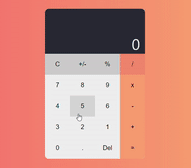

# 파일 완성하기  
시작하기 앞서 아래 내용은 **Hook**에 대한 이해가 필요합니다. 아직 Hook에 대해 자세히는 모른다면 **useState**가 무엇인지 정도만 간략하게 공부를 한 후 내용을 본다면 쉽게 이해할 수 있습니다.  
**App.js**의 파일 구성을 먼저 보겠습니다.  
```js
import React, {useState} from 'react';
import GlobalStyle from './style/Global';
// import ButtonPresenter from './components/Presenter/ButtonPresenter';
import ControlContainer from './components/Container/ControlContainer';
import Calculator from './components/Presenter/CalculatorPresenter';
import DisplayContainer from './components/Container/DisplayContainer';
import {evaluate} from 'mathjs';

let numExist = true;
const numArray = [];
let i = 1;

function App() {
  const [currentCal, setcurrentCal] = useState([]);
  const [resultCal, setresultCal] = useState('0');

  const tempChange = e => {
    const value = e.target.value;
    switch (value) {
        //C 버튼 구현
      case 'C':
        setresultCal(기본값
        setcurrentCal('');
        break;
        //+버튼 구현
      case '+':
        if (resultCal === '0') {
          break;
        } else {
          setcurrentCal(`${resultCal}+`);
          numExist = false;
          i = 1;
          break;
        }
        //기본값
      default:
        if (resultCal === '0') {
          setresultCal(value);
          numArray[0] = value;
        } else if (numExist === true) {
          setresultCal(resultCal + value);
          numArray[i] = value;
          i += 1;
        } else {
          setresultCal(value);
          numArray[0] = value;
          numExist = true;
        }
    }
  };
  return (
    <>
      <Calculator>
        <DisplayContainer CurrentCal={currentCal} ResultCal={resultCal} />
        <ControlContainer calculateFunc={tempChange} />
      </Calculator>
      <GlobalStyle />
    </>
  );
}

export default App;

```  

함수를 직관적으로 읽으면 바로 알수 있듯이 다소 애매하게 계산기가 완성되어 있습니다. 바로 **+버튼**과 **C버튼** 말이죠  

한번 화면에서 보겠습니다.  

먼저 C버튼에 대한 구현을 보겠습니다.  

  

사진을 보면 알겠지만 숫자를 눌렀을때 0이 그대로 남아있고 다소 애매한 부분이 많다는 것을 알 수 있습니다.  

똑같이 +버튼을 보겠습니다.  

  

여러분들이 하실 일은 위와 같이 계산기라고 부르기는 애매한 함수를 완성하는 역할을 해야합니다. 전체 코드에도 구현이 되어있지만 아래 부분을 수정하거나 추가를 해서 훌륭한 계산기를 완성하기 바랍니다.  

```js  
const tempChange = e => {
    const value = e.target.value;
    switch (value) {
        //C 버튼 구현
      case 'C':
        setresultCal(기본값
        setcurrentCal('');
        break;
        //+버튼 구현
      case '+':
        if (resultCal === '0') {
          break;
        } else {
          setcurrentCal(`${resultCal}+`);
          numExist = false;
          i = 1;
          break;
        }
        //기본값
      default:
        if (resultCal === '0') {
          setresultCal(value);
          numArray[0] = value;
        } else if (numExist === true) {
          setresultCal(resultCal + value);
          numArray[i] = value;
          i += 1;
        } else {
          setresultCal(value);
          numArray[0] = value;
          numExist = true;
        }
    }
```  

방법에 대한 방향성은 없습니다. 검색을 해도 좋고 스위치문이 아닌 **다른 방식으로 구현해도 상관없습니다.** 다만 **JS**만을 활용해서 react 범위 안에 해결하기 바랍니다. 마지막으로 옳게 구현된 버전을 한번 보여드리겠습니다.  

  

물론 저도 좋은 결과물은 아니지만 다들 힘내셔서 괜찮은 결과물을 만드셨으면합니다!  
계산기가 완료된다면 그 다음 바로 이 계산기를 **electron**을 이용해서 진짜 프로그램처럼 만들어 볼 예정입니다. 다들 원래 어려우니 어렵다고 포기하지 마시고 힘내시기 바랍니다  